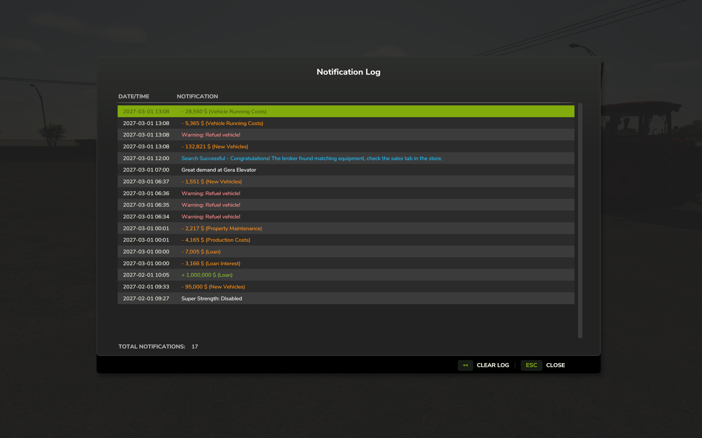

# FS25_NotificationLog

Did the notifications fly by too fast? Use the Notification log to see all notifications in the current session. 

**Singleplayer only.**

## Notes
Since there is no proper documentation for modding FS25 yet, this mod is made by trial and error and looking at other mods. It may not work as expected and could potentially cause issues with your game.

Default key binding is `Right Shift + M` to open the notification log interface. You can change this in the game settings under "Controls".

Source code and issue tracker at https://github.com/rittermod/FS25_NotificationLog

## Features
- **Notification Logging**: Automatically captures top notifications, side notifications, and blinking warnings
- **GUI Interface**: View session notification history in a dialog (accessible via Right Shift + M)
- **Notification Details**: Displays the in-game date/time, and notification content
- **Color Preservation**: Maintains original notification colors for easy categorization
- **Warning Filtering**: Blinking warnings are logged once per source and in-game minute to prevent spam
- **Clear Log**: Remove all notifications with a single button

## Installation
1. Download the latest release from the [GitHub releases page](https://github.com/rittermod/FS25_NotificationLog/releases/latest)
2. Move or copy the zip file into your Farming Simulator 2025 mods folder, typically located at:
   - Windows: `Documents/My Games/FarmingSimulator2025/mods`
   - macOS: `~/Library/Application Support/FarmingSimulator2025/mods`
3. Make sure you don't have any older versions of the mod installed in the mods folder

## Screenshots
Notification log interface showing a list of notifications with date, time, and content.
